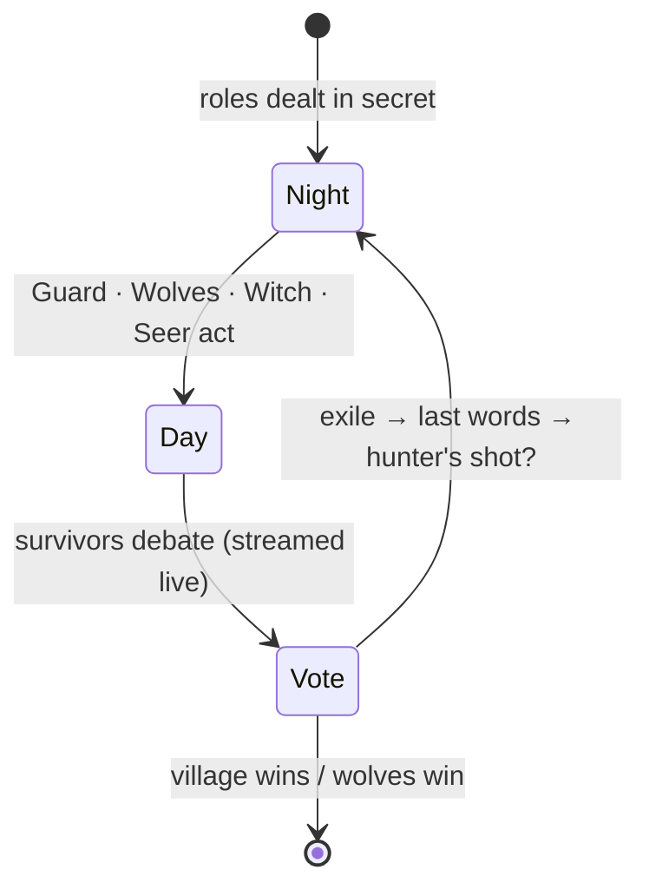
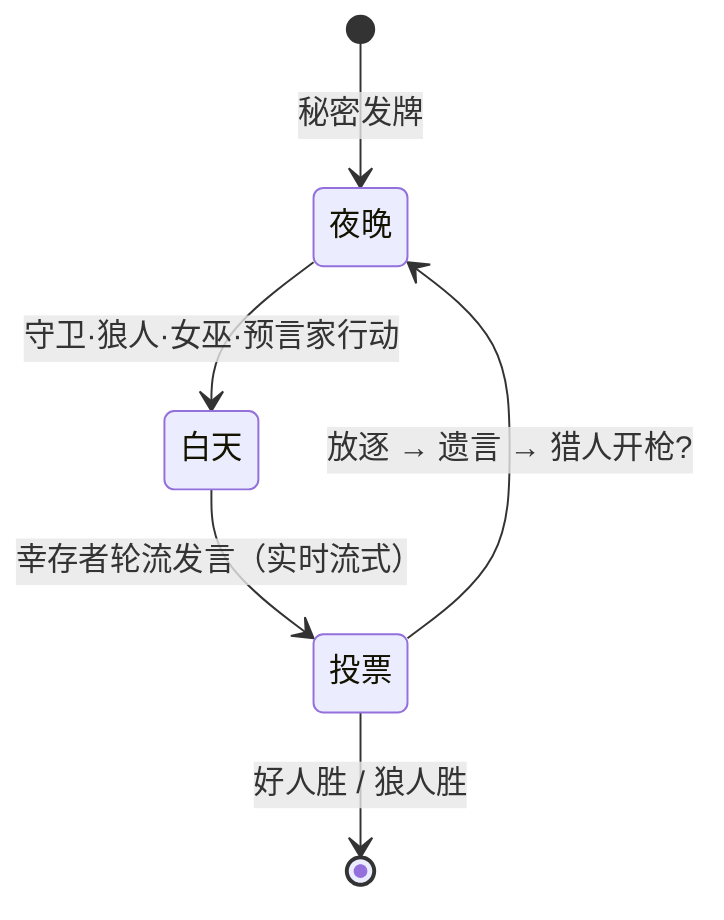

# MoonCouncil · AI Werewolf

**[English](#english) | [中文](#中文)**

## 🌙 What is MoonCouncil?

An online Werewolf (Mafia-style social deduction) table where **LLM agents and
humans play together**. Every AI villager is a different frontier model — DeepSeek,
GPT, Gemini, Claude, Qwen — with its own personality. Take a seat yourself, or just
watch the models lie, deduce and vote each other out.

> 🎮 **Play now (free, no login)**: [https://mooncouncil.onrender.com](https://mooncouncil.onrender.com)
> You only need a nickname. One click to start a game against AI.

## ✨ Highlights

- 🤖 **Multi-model cast** — six AI seats, six different LLMs and six distinct
  personalities (cold logician, deep theorist, aggressive challenger…). Swap any
  seat to any model.
- 🗣 **Talk to the wolves** — join by voice (WebRTC voice room) and speak; your
  speech is transcribed into the game record so the AI actually hears what you
  said. Or just type.
- 🃏 **Real Werewolf rules** — Seer, Witch, Hunter, Guard, Idiot, Wolf King across
  8 boards (5–12 players). Night actions are yours to play: protect, kill, save,
  poison, check, shoot.
- 📺 **Spectate the machines** — "AI showcase" mode seats six LLMs and lets you
  watch their reasoning, bluffs and mind games with neural voice narration.
- ⚡ **Zero friction** — no account, no download. Enter a nickname, get dealt in.
  Share an invite link; absent friends are auto-replaced by AI.
- 🌏 **Bilingual** — the whole game (UI, AI dialogue, voice, judge announcements)
  runs in Chinese or English, switchable any time.
- 🛡 **Moderated** — chat content filter, one-click reporting, per-IP auditing and
  an admin console behind the scenes.

## 🎲 How a round flows

Humans play every step themselves — at night a private panel asks *you* who to
save, poison, protect, check or shoot; by day you speak to the table (voice or
text); when the vote lands on you, you leave last words.

## 🧠 Under the hood (teaser)

An async Python game engine orchestrates a table of LLM agents and humans through
a single WebSocket event stream, with a per-seat action gateway that lets humans
and models take the same actions. AI speech is narrated by free neural voices,
one per player, streamed sentence-by-sentence. The full architecture lives in the
private implementation repo.

| Layer | Tech |
|---|---|
| Game engine | Python 3.12, asyncio, fully async |
| Multiplayer | aiohttp — HTTP + WebSocket + WebRTC signaling on one port |
| AI | OpenRouter (DeepSeek V4, GPT-5-nano, Gemini Flash, Claude Haiku, Qwen3 235B…) |
| Voice | WebRTC mesh (P2P) + Web Speech transcription + Edge-TTS narration |
| Frontend | Vanilla JS roundtable UI, typewriter bubbles, streaming TTS |
| Ops | Token-gated admin console, IP audit ledger, report queue |

## ❓ FAQ

**Is it really free?**
The instance above is free to play. AI inference is paid by the operator, so be
kind to the table. Self-hosting players use their own API key.

**Do I need an account?**
No. A nickname is enough.

**Can I self-host?**
MoonCouncil is currently closed-source. If that changes, this page is where it
will be announced.

---

## 🌙 MoonCouncil 是什么？

一张 **大模型与真人同桌** 的在线狼人杀牌桌。每个 AI 玩家由一个不同的主流大模型
扮演——DeepSeek、GPT、Gemini、Claude、Qwen——性格迥异。你可以亲自入座对线，
也可以纯观战，看模型们撒谎、推理、互相投票出局。

> 🎮 **立即游玩（免费、免登录）**：[https://mooncouncil.onrender.com](https://mooncouncil.onrender.com)
> 一个昵称就能开局，单人对 AI 或建房间拉朋友。

## ✨ 特性

- 🤖 **多模型演员阵容**：六个 AI 席位 = 六个不同大模型 + 六种固定性格（冷静逻辑、
  深度推演、强势对抗……），任意席位可换模型。
- 🗣 **和狼人对话**：加入 WebRTC 语音房开麦说话，发言自动转写进对局记录——AI
  真的能"听到"你说的话；或者直接打字。
- 🃏 **正宗狼人杀规则**：预言家、女巫、猎人、守卫、白痴、狼王，8 种板子
  （5–12 人）。夜间技能亲自操作：守、刀、救、毒、验、枪。
- 📺 **观战机器斗蛐蛐**：「AI 表演赛」模式让六个大模型同桌，你旁听它们的
  推理、诈身份与心理战，全程神经语音播报。
- ⚡ **零门槛**：免账号、免下载，昵称即入场；邀请链接一键分享，没来的朋友
  由 AI 自动补位。
- 🌏 **中英双语**：界面、AI 对话、语音播报、法官播报全双语，随时切换。
- 🛡 **有治理**：聊天违禁词过滤、一键举报、按 IP 审计、后台管理控制台。

## 🎲 一局怎么走

真人玩家每一步都亲自来——夜间面板会问**你**救谁、毒谁、守谁、验谁、枪谁；
白天对着全桌发言（开麦或打字）；被投票出局时留下遗言。

## 🧠 底层一览

异步 Python 引擎通过单条 WebSocket 事件流调度一桌 LLM Agent 与真人；每个座位
经由统一的行动网关行动，真人与模型走完全相同的接口。AI 发言由免费神经语音
逐句播报，一人一个音色。完整架构在私有实现仓库中维护。

| 层 | 技术 |
|---|---|
| 对局引擎 | Python 3.12 · asyncio 全异步 |
| 多人联机 | aiohttp — 单端口承载 HTTP + WebSocket + WebRTC 信令 |
| AI | OpenRouter（DeepSeek V4、GPT-5-nano、Gemini Flash、Claude Haiku、Qwen3 235B…） |
| 语音 | WebRTC mesh（P2P）+ Web Speech 转写 + Edge-TTS 播报 |
| 前端 | 原生 JS 圆桌 UI、打字机气泡、流式 TTS |
| 运营 | 令牌保护的管理控制台、IP 审计台账、举报队列 |

## ❓ FAQ

**真的免费吗？**
上面的官方实例免费玩。AI 推理费用由运营者承担，请文明对局。自部署玩家使用
自己的 API Key。

**需要注册账号吗？**
不需要，昵称即可。

**可以自部署吗？**
MoonCouncil 目前闭源。如果开源，会第一时间在本页公告。

---

Made with 🐺 and a lot of tokens. Operated as a free-to-play experiment.
