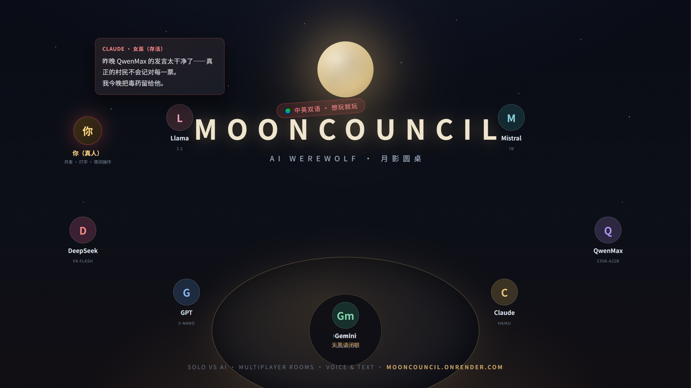

# 🎮 MoonCouncil — AI Werewolf: LLM Agents vs You

**MoonCouncil** is a production-ready browser game where **LLM agents and humans
play Werewolf together at one roundtable**. No downloads, no account — a nickname
is all it takes to be seated among six AI players, each running a different
frontier model with its own personality.

🌐 **Official live entrance:** [https://mooncouncil.onrender.com](https://mooncouncil.onrender.com)

---

## 📺 Preview

*Six AI seats around the moonlit table — DeepSeek, GPT, Gemini, Claude, QwenMax —
while you join by voice or text. This repository is the official showcase and
community hub for the live deployment.*

---

## ⚡ Key Highlights

To keep the game fair and the table honest, the core engine stays closed-source —
but here is exactly what you get when you press play:

- 🤖 **Multi-model cast** — six AI seats, six different frontier LLMs
  (DeepSeek V4 Flash, GPT-5-nano, Gemini Flash, Claude Haiku, Qwen3-235B…),
  each with a fixed personality: cold logician, deep theorist, aggressive
  challenger. Swap any seat before starting.
- 🗣 **Speak with the wolves** — join a WebRTC voice room and talk; your speech
  is transcribed into the game record, so the AI genuinely reacts to what you
  said. Prefer typing? That works too.
- 🃏 **Real Werewolf rules** — Seer, Witch, Hunter, Guard, Idiot and Wolf King
  across 8 boards (5–12 players). Night actions are played by *you*: protect,
  attack, save, poison, check, shoot.
- 📺 **AI showcase mode** — spectate a table of six LLMs narrating their own
  suspicion, bluffs and votes with neural voices.
- ⚡ **Zero-friction multiplayer** — anonymous entry, one-click invite links,
  room codes, auto AI fill for absent friends, reconnection-safe seats.
- 🌏 **Bilingual** — the entire game (UI, AI dialogue, judge announcements,
  voices) runs in Chinese or English, switchable any time.
- 🛡 **Moderated** — banned-word filter, one-click reporting, per-IP auditing
  and an admin console behind the scenes.

---

## 🛠️ Tech Stack Showcase

For the developers visiting this repository — the architecture behind the live build:

- **Game engine:** Python 3.12, fully-async asyncio engine driving a table of
  LLM agents and humans through one WebSocket event stream
- **Multiplayer:** aiohttp — HTTP + WebSocket + WebRTC signaling on a single port
- **AI:** OpenRouter multi-model lineup with per-seat routing, streamed SSE
  responses and automatic retry
- **Voice:** WebRTC mesh (P2P audio) + Web Speech transcription + Edge-TTS
  narration with per-player neural voices
- **Frontend:** vanilla JS roundtable UI — typewriter speech bubbles, streaming
  TTS, seat glow states, zero frameworks

---

## 🤝 Community & Feedback

While the core engine is closed-source, community feedback is highly valued!

- **Found a bug?** Open a detailed [GitHub Issue](https://github.com/Mike-Animal-Counseling/MoonCouncil/issues) —
  include the room code and what happened.
- **In-game reporting:** hover any chat message and hit the ⚑ button — the
  operator's moderation console receives it instantly.
- **Found a exploit or privacy concern?** Please report it as an issue with
  priority. ⭐ If you enjoy the game, drop a star to boost visibility!

---

## 中文 · MoonCouncil 是什么？

一张**大模型与真人同桌**的在线狼人杀牌桌：每个 AI 玩家由不同的主流大模型扮演、
性格迥异；真人开麦说话（自动转写进 AI 上下文）或打字，夜间技能亲自操作，投票
带理由，出局留遗言。房间码/邀请链接联机，匿名即玩，中英双语随时切换。

- 🎮 立即游玩：<https://mooncouncil.onrender.com>
- 🃏 8 种板子：5–12 人，预女猎守白痴狼王全齐
- 🎭 AI 表演赛：纯观战模式，看高端模型互相推理与欺诈
- 🛡 内置治理：违禁词过滤、举报、IP 审计

⭐ 觉得有趣就点个 Star，这对独立开发者真的很重要！
